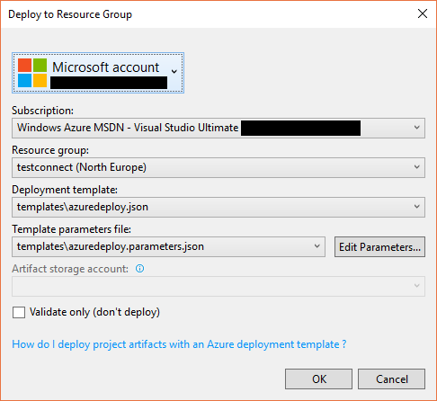
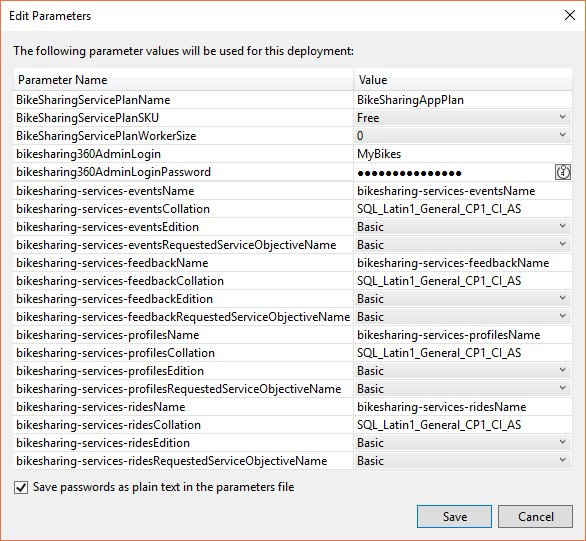
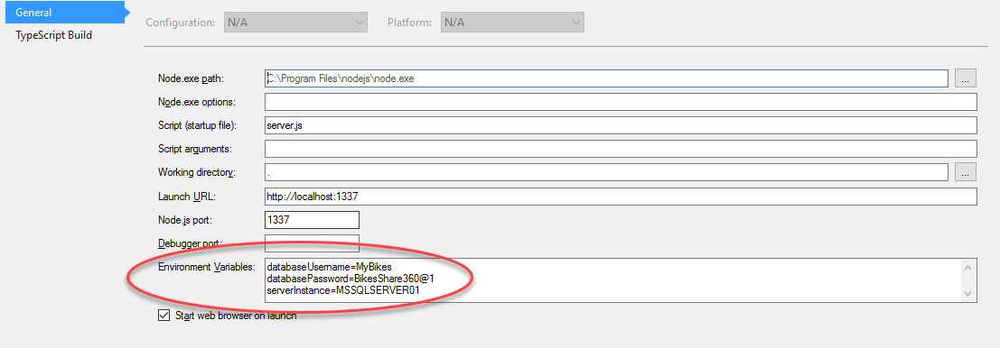

Connect() 2016 Demos - Microservices
====================================

What is in this repo?
---------------------

This repo contains the **backend microservices** used in various Connect() demos (mainly the Xamarin apps).

How to install the Microservices?
---------------------------------

Easiest way is to use a Azure AppService per Microservice. To create and deploy all microservices, you only need an Azure Subscription and a Computer with the following software installed:

1. Visual Studio 2015 Update 3. Microservices code are in netcore and nodejs. Netcore microservices are based on project.json not on csproj, so don't use Visual Studio 2017. If you want to use VS2017 RC use the VS2017 branch.
2. Azure SDK .NET (2.9.6)

** Note:** The branch **VS2017** contains the same code ready to be loaded and compiled using VS2017 RC and the netcore tools in preview3 (no project.json).

You also need an active Azure subscription.

Open the solution _BkeSharing.Services.Deploy.sln_. This solution contains the Microservices code and one ARM project to deploy them on any Azure Subscription. Open with VS2015, right click over the "BikeSharing.Services.Deploy" project and select "Deploy -> New".

A dialog box will appear, asking you for your account and allowing you to select the subscription to use:

You can select one resource group or create one new. A set of default parameters has been provided, but you can override them with your own values clicking the "Edit parameters" button:

You can choose database names, SKUs to use and some other values (database login and password).

Once you've finished setting the parameters you can just click the "OK" button and the Microservices and databases will be deployed on the choosen resource group.

**Note: Microservices code is compiled** when you run the script, and **any compiler warning** is treated by an error by the publishing script. Current code has 0 errors and 0 warnings, but we aware if you edit the microservices code. If any warning is shown, Visual Studio will tell you that the deployment to Azure failed.

**Note:** Databases are created with no data. To add data to the database follow the steps in the next section.

Adding data to databases
------------------------

Once databases are created, you can run the SQL files to fill some sample data. You can use SQL Management studio or
your preferred tool to run the SQL files provided.

The files are in _/src/sql_, and there is one sql file for each database (rides-data.sql, feedback-data.sql, profiles-data.sql, events-data.sql)

**Note:** The _rides-data.sql_ is very big (around 0.5GB) because contains a lot of data. For that reason is zipped.

Resources created in Azure
--------------------------

ARM project creates the following resources in Azure:

* **1 SQL server **
* **4 SQL Azure databases ** (one per each microservice)
* **4 AppServices ** (one per each microservice)
* **1 Storage account **

Also it deploys the code to the 4 appservices and the schema to the 4 databases.

Database projects
=================

The solution file _BikeSharing.Services.sln_ contains **the code of all microservices AND database projects**. If you update the database schema, you can create a new DACPAC file using the dataase project.

**Note:** Database schema is deployed during the ARM project deployment by publishing DACPAC files. Those files were generated by these database projects (but just be aware that database projects are *not* compiled during the ARM deploy process. The ARM project has their own dacpac files in _src/BikeSharing.Services.Deploy/Data/dacpac_).

Testing code in local environment
=================================

For testing the code for local environment you need to create the databases. ** Best way to create databases is using the database projects**. Just load them with Visual Studio 2015 and then publish them into your local database.

Then **update the config file of each microservice** (_appsettings.json_) and set the needed values (DB connection strings.)
The Rides service is different because is a nodejs microservice, so no _appsettings.json_ file exists. Configuration is using environment variables. Best way to set them with VS2015 is via "Project -> Properties" and set the environment variables:

Valid values are:

* **database** Name of the database (defaults to biksharing-services-rides)
* **databaseUserName** User name of db server
* **databasePassword** User password
* **databaseServer** Database server name (defaults to localhost)
* **serverInstance** Database instance name (only needed if not default instance is used)

SQL Server must be accessible via TCP protocol and has to have SQL authentication enabled.

Azure Functions code
====================

The folder _/azure-functions/ contains the solution _BikeSharing-Functions.sln_ with the code of the _AvatarPhotoProcess_ Azure Function (showed by Beth Massi). Function **is not** published to Azure by the ARM project.

If you publish the function, then **update the AzureWebJobsStorage setting of the FunctionApp** to use the storage deployed in the ARM project. This will ensure that photos uploaded by mobile app are processed by the Azure function.

Also you need to do two manual things in your Azure subscription:

1. Add a Cognitive API Services to your Azure Subscription (Face API)
2. Create an AppSetting in the FunctionApp named **Vision_API_Subscription_Key** with the value of the API KEY of the Face API.

**Note:** Azure functions projects are only supported by VS2015 Update 3 and require the [Visual Studio Tools for Azure Functions](https://blogs.msdn.microsoft.com/webdev/2016/12/01/visual-studio-tools-for-azure-functions/) installed.

Final Notes
===========

* Password is not really validated on login. If login is correct any not-null password is valid. This is to avoid errors on demos and showcases
* All APIs (except the rides one) have swagger enabled

